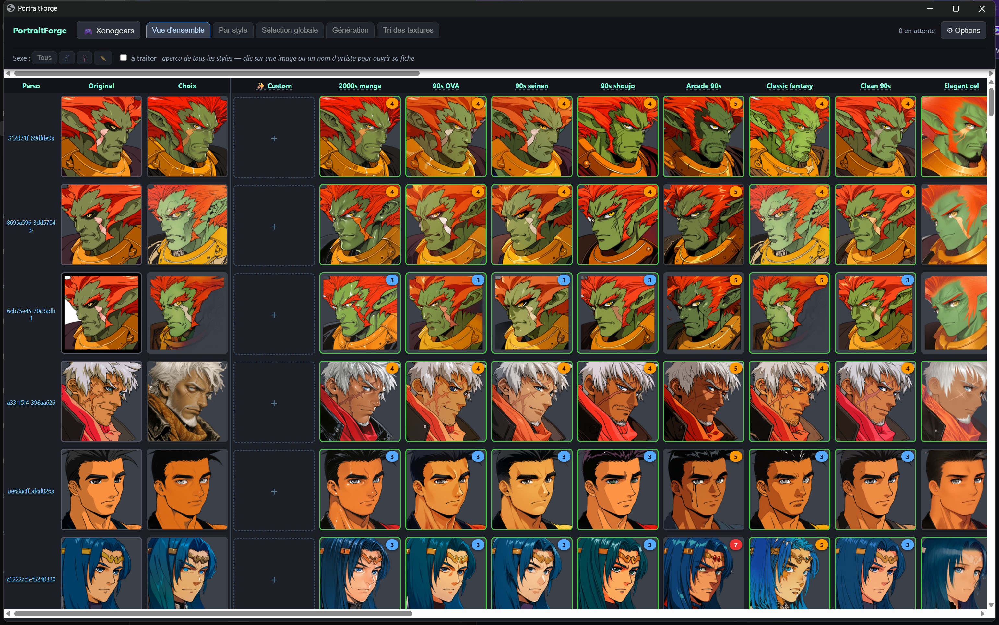

# 🎨 PortraitForge

**Re-style a whole game's character portraits with Stable Diffusion — and ship them as an HD texture pack.**

PortraitForge drives a local [ComfyUI](https://github.com/comfyanonymous/ComfyUI) (SDXL img2img + ControlNet) to regenerate every character portrait of a game in the art styles of your choice, then helps you *curate* the results: compare, select, and export straight into a texture-replacement pack. Built for retro-game HD packs (PSX-era portraits → 1024px art), usable for any folder of portraits.


*Shown with user-configured styles on a Xenogears HD pack — game art © its owners; no game assets are included in this repository.*

## Features

**Generation**
- SDXL **img2img + ControlNet union** keeps each character's pose and silhouette while fully changing the art style.
- **Styles are plain JSON** (`styles.example.json` ships with 8 generic styles — manga 90s, ligne claire, watercolor, comics…). Add your own LoRAs and prompts in your local `styles.json`.
- **Auto-tagging** (WD ViT tagger, ONNX, CPU): hair/eye color, glasses, helmets… are detected per character and injected into every prompt, so a blond stays blond in every style. Per-character sex/custom tags.
- **Transparent portraits handled end to end**: ISNet-anime matting removes the white halo around regenerated characters; output keeps clean alpha.
- Generation **queue with live progress and ETA**, FIFO order, priority button, **persistent across crashes**, and a **ComfyUI watchdog** that relaunches the backend if it dies.
- Every PNG stores its **full generation parameters** — one click re-runs any image with its exact settings (or tweaked).

**Curation**
- Matrix views (characters × styles), per-style browsing, a **global pick** per character, completion tracking and a "to do" filter.
- Zoomable comparison lightbox with dense A/B/C/D mode, background switcher, keyboard-driven triage.
- **Undo-able deletes** (trash + Ctrl+Z), custom drag-and-drop ordering, multi-game support.
- **Export**: selected images are resized to each original texture's exact size and installed into your texture pack folder, with automatic backup of the pack's originals.

## Requirements

- Windows, Python 3.10+ (only **Pillow** is required for the app; `onnxruntime` + `numpy` for auto-tagging/matting, downloaded models fetch on first use)
- A working **ComfyUI** install with: an SDXL checkpoint (or two — Pony-style and Illustrious-style defaults are referenced in the config) and `controlnet-union-sdxl-promax`

## Quick start

```bash
git clone https://github.com/hypedigger/PortraitForge.git
cd PortraitForge
powershell -ExecutionPolicy Bypass -File install.ps1
```

(or manually: `pip install -r requirements.txt`)

1. Edit `launch_config.json` so `python` and `comfy_main` point at your ComfyUI install.
2. Put your game's original portraits (PNG) in `<work_dir>/_originals/` — the app asks for the work directory on first run (🎮 button).
3. Run `launch.ps1` (starts ComfyUI headless + the app) or `python app.py`, then open **http://127.0.0.1:8777**.
4. Pick a style → *Générer les manquants* → triage → *Exporter*.

Your personal files (`styles.json`, `app_settings.json`, `games.json`, generated images) stay local and are never committed.

## Notes

- The UI is currently in French; contributions welcome.
- Style presets are deliberately **generic** (medium/era descriptors, no artist names). What you put in your own `styles.json` is up to you.
- This tool generates images from textures you supply. Respect the rights of game and artwork owners when distributing packs.

## Support

If PortraitForge powers your texture pack:

[](https://ko-fi.com/hypedigger)

## License

[MIT](LICENSE)
